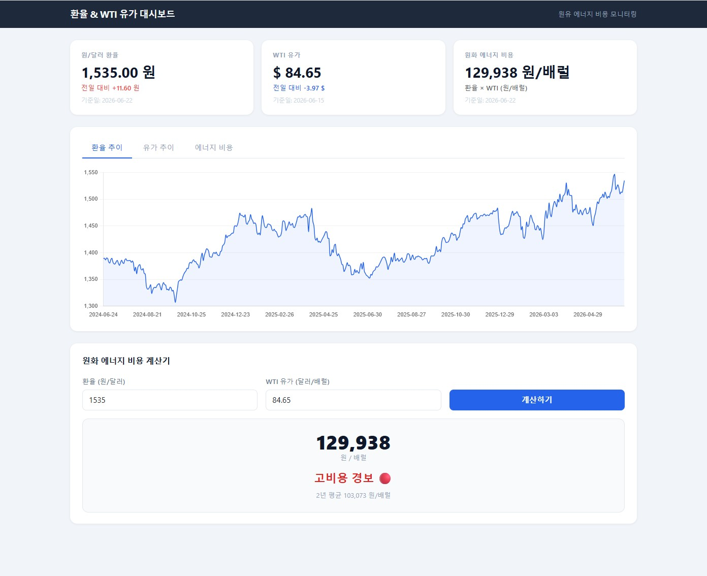
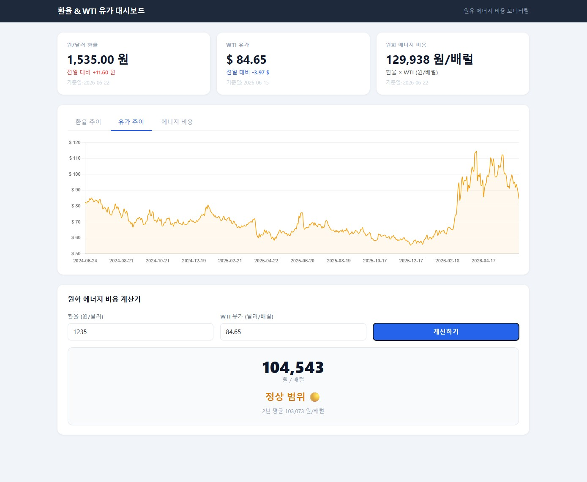
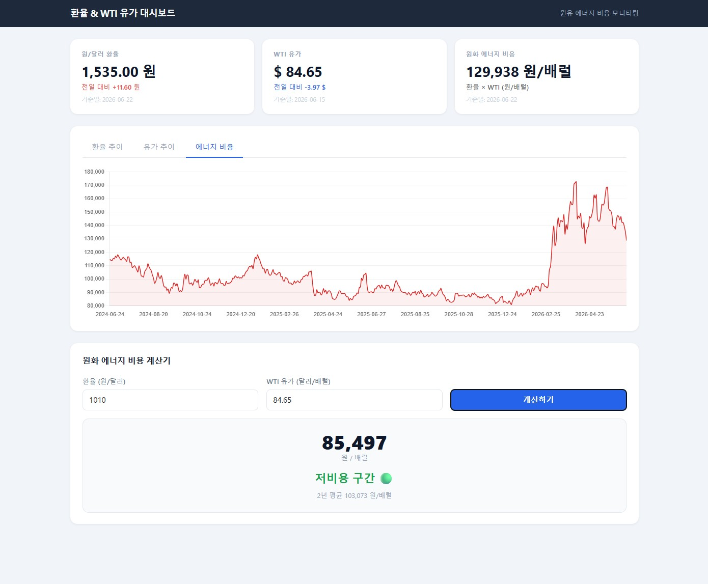

# WTI_monitor_ETL

원/달러 환율(ECOS)과 WTI 유가(FRED)를 수집해 MySQL에 적재하는 자동화 파이프라인.

> 원유는 달러로 결제되므로 환율 상승 + 유가 상승이 겹치면 한국의 에너지 비용 이중 타격.
> 두 지표를 함께 수집해 상관관계를 분석하기 위함.

---

## 폴더 구조

```
~/WTI_monitor_ETL/
├── .env                            # API키, DB접속정보 (git 제외)
├── .gitignore
├── README.md
├── backend/
│   ├── app.py                      # FastAPI 서버
│   ├── etl.py                      # ETL 스크립트 (ECOS + FRED 증분 적재)
│   ├── run_etl.sh                  # crontab 자동화 스크립트
│   ├── requirements.txt            # Python 의존성
│   └── venv/                       # Python 가상환경 (git 제외)
├── frontend/
│   ├── templates/index.html        # 대시보드 UI
│   └── static/style.css            # 스타일
├── db/
│   └── schema.sql                  # 테이블 DDL
└── docs/
    ├── api.md                      # API 엔드포인트 명세
    └── screenshots/                # 대시보드 스크린샷
```

---

## Screenshots

**환율 추이 (USD/KRW)**


**WTI 유가 추이**


**원화 에너지 비용**


---

## 데이터 소스

| 지표 | API | 시리즈 |
|------|-----|--------|
| 원/달러 환율 매매기준율 | 한국은행 ECOS | 통계코드 `731Y001`, 항목 `0000001` |
| WTI 유가 (달러/배럴) | FRED (St. Louis Fed) | `DCOILWTICO` |

---

## DB 구조

**DB명:** `exchange_rate`

```sql
CREATE TABLE usd_krw_daily (
  trade_date  DATE           NOT NULL,
  usd_krw     DECIMAL(10,2)  NOT NULL,
  created_at  TIMESTAMP      DEFAULT CURRENT_TIMESTAMP,
  PRIMARY KEY (trade_date)
);

CREATE TABLE wti_daily (
  trade_date  DATE           NOT NULL,
  wti_usd     DECIMAL(10,2)  NOT NULL,
  created_at  TIMESTAMP      DEFAULT CURRENT_TIMESTAMP,
  PRIMARY KEY (trade_date)
);
```

---

## 실행 방법

### 환경 설정

```bash
cd ~/WTI_monitor_ETL
python3 -m venv backend/venv
source backend/venv/bin/activate
pip install -r backend/requirements.txt
```

`.env` 파일 작성 (프로젝트 루트):

```
ECOS_API_KEY=your_key
FRED_API_KEY=your_key
DB_HOST=localhost
DB_PORT=3306
DB_USER=root
DB_PASSWORD=your_password
DB_NAME=exchange_rate
```

### ETL 수동 실행

```bash
source backend/venv/bin/activate
python backend/etl.py
```

### 대시보드 실행

```bash
source backend/venv/bin/activate
uvicorn backend.app:app --port 8001 --host 0.0.0.0
```

### 자동 실행 (crontab)

평일 14:00 KST 자동 실행. 로그는 `backend/etl.log`에 누적.

```
0 14 * * 1-5 /home/ubuntu/WTI_monitor_ETL/backend/run_etl.sh
```

---

## ETL 동작 방식

1. DB에서 `MAX(trade_date)` 조회
2. 데이터 없으면 **초기 적재** (최근 2년치)
3. 데이터 있으면 **증분 적재** (마지막 날짜 다음날 ~ 전날)
4. `INSERT IGNORE`로 중복 방지
